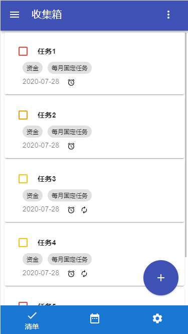
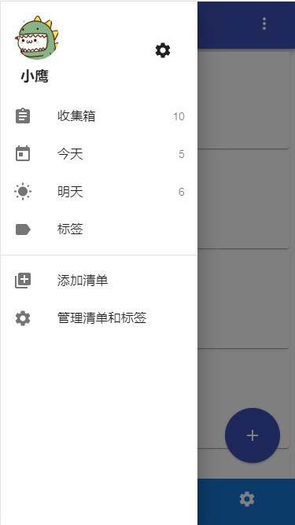
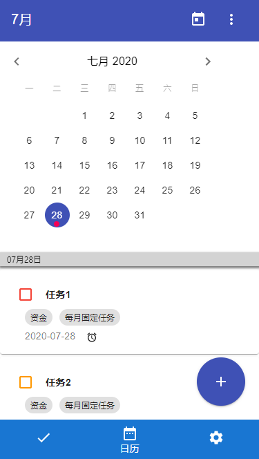
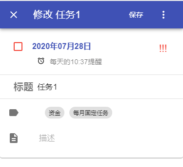
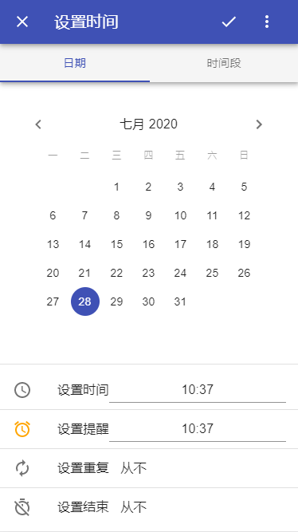

# Todolist By React

初学React，断断续续写了一个快写烂的todolist，功能好写，追求了一些样式，结合Material-UI写的。

仿滴答清单样式和功能，简单实现了一下。认为具有学习价值的功能已经实现，其他就是一些堆叠代码的功能，没有做。

## 截图

## 学习

仅做初学之用。

[x] 函数式组件的概念。*之前用class写的组件，后面全部推倒重新用函数式写了一遍。*
[x] 使用钩子
[x] 使用第三方组件库
[x] 使用router
[x] 使用redux
[x] 使用TypeScript，之前很少使用
